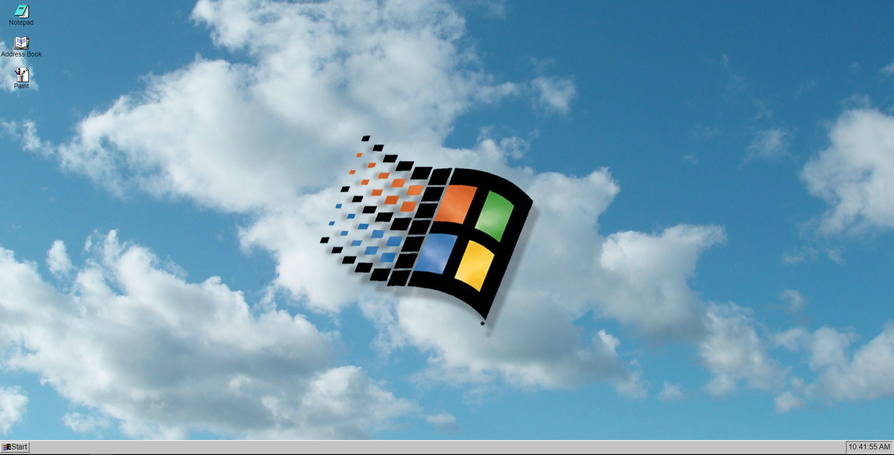

# fake-OS

## Preview

## Deployed Version

- [Link]( https://vercel.com/edrickhoo/fake-os)

## Setup

- Open index.html with live server
- [Link to download live server for VScode]( https://marketplace.visualstudio.com/items?itemName=ritwickdey.LiveServer)

## Description of project (spec / MVP)

### Requirement
*HTML
*CSS
*SASS
*Javascript

### Features
*You will be creating an SPA (Single Page Application) -- [x]
*Desktop has a wallpaper that fits the viewport -- [x]
*There will be selectable icons -- [x]
*Selecting an icon will open an "app", creating a modal to display some content -- [x]
*Able to close an app -- [x]
*There will be a selectable menu -- [x]
*Selecting the menu will display a list of text and icons -- [x]
*The current time is displayed somewhere -- [x]

### MVP:

#### HTML/SCSS
*Wallpaper scales to fit the viewport -- [x]
*Minimum 3 icons on desktop -- [x]
...-The menu is positioned in the appropriate place (bottom left on windows, top of the screen on android) -- [x]
...-Apps look consistent -- [x]
...-Menu contains a flex with content inside it -- [x]
...-Apps should be able to contain text, an image or a form -- [x]
#### JavaScript
...-Put your js code into separate files -- [x]
...-Your icons and menu should add event listener for the click event, don't use the html onclick attribute -- [x]
...-Give your functions and variables good names -- [x]
...-Use the arrow syntax to declare functions -- [x]

## Approach

-Broke the app into smaller sections and work on each small feature one by one eg. Working on taskbar, clock, startmenu, each small app one at a time.
-Research ideas online that I didnt have a good understanding of eg. Draggable windows
-This was made with Javascript instead of other frameworks to solidify my understanding of how to select elements in the DOM and to manipulate them, to give functionality or change styling.
-Tried to keep things modular with styles seperate in their own component files and linked to one file with sass, Javascript files were seperated logc files and DOM files.

## Reflection

- What went well?  Reference images were availiable online so I felt that the styling process was easier and went well.
- What are you proud of? I am proud that the paint app works as serveral bugs and debugs occured when building the application.
- What was a challenge? Making the windows draggable as trying to implement the function I was selecting the wrong elements and breaking the code.
- What you'd do differently? Try to create the rendering of the applications be done in reusable javascript code instead of hard-coding and hiding the divs.

## Future Goals

-Add more applications, eg. Photo gallery app
-Using DRY create DOM functions that render applications dymanically.
-Add testing for logic components
-Make the taskbar applications focus when it is clicked

## Further reading or links to inspiration

- [DOM CheatSheet]( https://fundamentals.generalassemb.ly/11_unit/dom-cheatsheet.html)
- [Code WET or DRY?]( https://dzone.com/articles/is-your-code-dry-or-wet#:~:text=DRY%20code%20is%20a%20software,t%20adhere%20to%20DRY%20principle.)
- [Breaking Down Monster Projects]( https://www.informit.com/articles/article.aspx?p=2153472)

### Stay in touch

- [Portfolio]( https://edric-khoo.vercel.app/)
- [Linkedin]( https://www.linkedin.com/in/edric-khoo-98881b173/)

